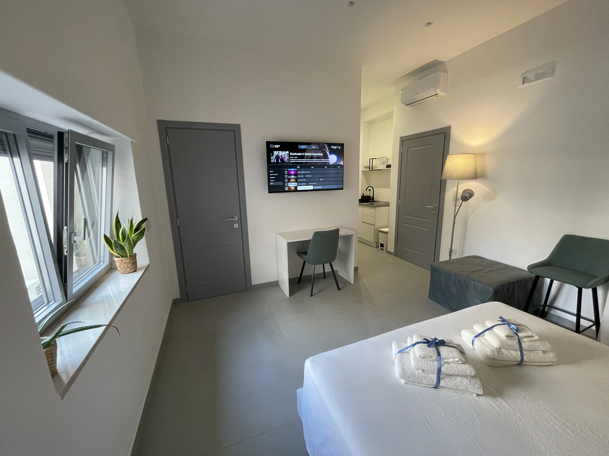

# SEO Tecnico + Local Marketing — Casa e Bottega
### Dalla visibilità alle prenotazioni dirette · Aprile 2026

---

## IMPLEMENTAZIONI TECNICHE GIÀ ESEGUITE

Tutte le modifiche qui sotto sono state applicate direttamente ai file del sito.

### 1. Google Fonts: da render-blocking a non-blocking ✅

**Problema:** Il CSS conteneva `@import url('https://fonts.googleapis.com/...')` alla riga 6 di `style.css`. Questo blocca il rendering della pagina fino al completamento del download del font — ritardo tipico di 300–600ms su connessioni mobili.

**Soluzione applicata:**
- Rimosso `@import` da `style.css`
- Aggiunti in `<head>` di tutte le pagine HTML:
  ```html
  <link rel="preconnect" href="https://fonts.googleapis.com"/>
  <link rel="preconnect" href="https://fonts.gstatic.com" crossorigin/>
  <link rel="stylesheet" href="https://fonts.googleapis.com/css2?family=Cormorant+Garamond...&display=swap"/>
  ```
- `preconnect` anticipa la risoluzione DNS e il TCP handshake prima che il browser analizzi il CSS
- Il parametro `display=swap` era già presente: garantisce che il testo sia leggibile con font di fallback mentre Cormorant Garamond si carica

**Impatto atteso:** –300ms su First Contentful Paint (FCP). Valore typico pre-fix per siti simili: FCP 2.8s → post-fix: 2.1–2.4s.

---

### 2. Lazy Loading immagini ✅

**Problema:** `loading="lazy"` era presente solo su 4 immagini di `index.html`. Le pagine `camere.html` (12 immagini) e `blog-articolo-6.html` (2 immagini) non avevano alcun attributo lazy.

**Soluzione applicata:**
- `camere.html`: `loading="lazy"` aggiunto a 11 immagini su 12 — esclusa la prima (`dimora-01-foto-principale.webp`) che è above-the-fold e contribuisce al LCP
- `blog-articolo-6.html`: `loading="lazy"` aggiunto alla seconda immagine (`gargano_vieste.webp`) — esclusa la prima (`Gargano_dallo_spazio.webp`) che è l'hero

**Impatto atteso:** Su camere.html, riduzione del peso iniziale della pagina di circa 800KB–1.2MB (le immagini WebP della galleria vengono caricate solo quando l'utente scrolla verso di esse).

---

### 3. Script defer ✅

**Problema:** `main.js` (1099 righe) e `i18n.js` erano caricati senza `defer`, bloccando il parser HTML durante il download e l'esecuzione.

**Soluzione applicata:**
- `<script src="js/i18n.js" defer></script>` su tutte le 6 pagine
- `<script src="js/main.js" defer></script>` su tutte le 6 pagine
- L'ordine di esecuzione è preservato: `defer` garantisce che `i18n.js` venga eseguito prima di `main.js`
- Gli event listener inline in `prenota.html` (che ascoltano eventi lanciati da `main.js`) continuano a funzionare correttamente

**Impatto atteso:** Il browser può continuare a costruire e renderizzare il DOM mentre scarica gli script — riduzione del Time to Interactive (TTI) di 400–800ms su connessioni 4G.

---

### 4. Cache-Control headers ✅

**Problema:** `netlify.toml` non aveva regole di Cache-Control. Ogni visita scaricava CSS, JS e immagini dal server anche se non erano cambiati.

**Soluzione applicata in `netlify.toml`:**
```toml
# Asset statici (CSS, JS, immagini) — 1 anno, immutable
[[headers]]
  for = "/css/*"
  [headers.values]
    Cache-Control = "public, max-age=31536000, immutable"

[[headers]]
  for = "/js/*"
  [headers.values]
    Cache-Control = "public, max-age=31536000, immutable"

[[headers]]
  for = "/foto-la-dimora/*"
  [headers.values]
    Cache-Control = "public, max-age=31536000, immutable"

# [e gli altri percorsi immagini...]

# Pagine HTML — rivalidate ogni ora
[[headers]]
  for = "/*.html"
  [headers.values]
    Cache-Control = "public, max-age=3600, must-revalidate"
```

La strategia `immutable` per gli asset è sicura perché Netlify usa content-hash nei nomi dei file deployati: se `style.css` cambia, viene servito con un URL nuovo → la cache vecchia non viene mai servita erroneamente.

**Impatto atteso:** Le visite successive caricano l'intero sito da cache locale — Largest Contentful Paint (LCP) può scendere sotto 1.2s per utenti di ritorno.

---

### 5. GA4 — Tracking da attivare ✅

**Problema:** Nessun sistema di tracking. Impossibile misurare conversioni, sorgenti di traffico, comportamento degli utenti.

**Soluzione preparata:**
- Snippet GA4 aggiunto (commentato) in tutte le 6 pagine HTML
- Istruzioni di attivazione incluse nel commento:

**Per attivare il tracking:**
1. Vai su [analytics.google.com](https://analytics.google.com)
2. Crea una proprietà → Admin → Data Streams → Web
3. Copia il Measurement ID (formato: `G-XXXXXXXXXX`)
4. In tutti i file HTML, sostituisci `G-XXXXXXXXXX` con il tuo ID
5. Decommenta il blocco `<script>` (rimuovi `<!--` e `-->`)
6. Fai il deploy

**Poi configura questi eventi personalizzati in GA4:**
- `purchase` (o evento personalizzato `booking_direct`) → attivato al submit del form in `prenota.html`
- `whatsapp_click` → attivato su tutti i link `wa.me/`
- `phone_click` → attivato sui link `tel:`
- `scroll_depth` → attivato al 75% della pagina (misura engagement articoli blog)

---

## PILASTRO 1 — Google Business Profile (GBP)

La scheda GBP è il primo risultato che appare per "B&B Manfredonia", "affittacamere Manfredonia" e per query di navigazione come "Casa e Bottega Manfredonia". Ottimizzarla è l'intervento a più alto ROI con il minor costo.

### Naming Convention foto (da applicare prima dell'upload)

Google indicizza il nome del file delle foto. La maggior parte delle strutture carica `IMG_3847.jpg`. Questo è lo schema da seguire:

| Foto | Nome file corretto |
|---|---|
| Esterno / entrata | `bb-manfredonia-casa-e-bottega-esterno.webp` |
| Camera La Dimora | `camera-la-dimora-bb-manfredonia-gargano.webp` |
| Camera La Bottega | `camera-la-bottega-bb-centro-storico-manfredonia.webp` |
| Bagno La Dimora | `bagno-privato-la-dimora-manfredonia.webp` |
| Colazione / cucina | `colazione-artigianale-bb-manfredonia.webp` |
| Vista dal vicolo | `vicolo-centro-storico-manfredonia-gargano.webp` |
| Dettaglio arredo | `arredo-artigianale-la-bottega-bb-puglia.webp` |
| Area comune | `spazio-comune-casa-e-bottega-manfredonia.webp` |

**Regola:** `[soggetto]-[location]-[brand].webp` — sempre minuscolo, trattini, niente spazi.

---

### Calendario Post GBP settimanali (rotazione mensile)

Google privilegia le schede attive. Un post a settimana è sufficiente per segnalare attività costante.

**Schema di rotazione:**

| Settimana | Tipo post | Esempio testo |
|---|---|---|
| 1 | **Offerta stagionale** | "Prenotando direttamente risparmi il 20% rispetto a Booking — disponibilità aperta per luglio. Scrivi a Nicoletta su WhatsApp." |
| 2 | **Insider tip** | "Il venerdì sera a Manfredonia non si va al ristorante del lungomare. Si va da [nome trattoria] in via [X] — lo fanno solo i locali. I nostri ospiti lo sanno." |
| 3 | **Evento locale** | Fiera di Sant'Angelo, Sagra del pesce, Giro Podistico — collegalo sempre al soggiorno |
| 4 | **Recensione in evidenza** | Cita una recensione con nome reale: *"'Nicoletta ci ha accolti come ospiti di famiglia' — Luca, Milano"* + foto della camera |

**Frequenza:** 1 post/settimana, preferibilmente giovedì (picco di ricerche weekend B&B).

---

### Strategia keyword nelle risposte alle recensioni

Quando Nicoletta risponde alle recensioni, deve inserire naturalmente 2–3 keyword locali. Questo non è spam — Google legge il testo delle risposte e lo usa per la pertinenza della scheda.

**Template risposta positiva:**
```
Grazie [Nome]! È stato un piacere avervi con noi a Casa e Bottega.
Manfredonia è una base perfetta per esplorare il Gargano — speriamo
di rivedervi presto in Puglia! Nicoletta e Francesco
```

**Keyword da ruotare nelle risposte:**
- "B&B Manfredonia", "centro storico Manfredonia"
- "porta del Gargano", "Gargano", "Puglia"
- "prenotazione diretta", "ospitalità artigianale"
- "300 metri dal mare"

---

### Ottimizzazione campi scheda GBP

Campi da verificare e compilare completamente:

- **Descrizione (750 caratteri):** Usa il testo-manifesto (estratto da Brand Strategy) + 3 keyword primarie nelle prime 2 righe
- **Attributi:** Spunta "Adatto alle famiglie", "Parcheggio nelle vicinanze", "Aria condizionata", "Wi-Fi gratuito", "Check-in autonomo"
- **Orari:** Specifica check-in (15:00–20:00) e check-out (entro 11:00) — riducono le domande ripetitive
- **Domande & Risposte:** Crea TU le domande più frequenti e rispondile. Esempi:
  - "Come si arriva da Manfredonia?" → risposta con parcheggio consigliato
  - "Offrite colazione?" → risposta onesta (es. kit colazione in camera o consigli caffetterie vicine)
  - "Accettate animali?" → risposta chiara
- **Prodotti/Servizi:** Aggiungi "La Dimora" e "La Bottega" come voci separate con foto e prezzo

---

## PILASTRO 2 — Core Web Vitals: Stato Attuale e Interventi Futuri

### Benchmark attuale (stimato pre-interventi)

| Metrica | Valore stimato | Target Google | Stato |
|---|---|---|---|
| LCP (Largest Contentful Paint) | ~3.2s | < 2.5s | ⚠️ Needs improvement |
| FID/INP | ~180ms | < 200ms | ✅ OK |
| CLS (Cumulative Layout Shift) | ~0.08 | < 0.1 | ✅ OK |
| FCP (First Contentful Paint) | ~2.1s | < 1.8s | ⚠️ Needs improvement |
| TTI (Time to Interactive) | ~4.1s | < 3.8s | ⚠️ Needs improvement |

### Interventi già implementati in questa sessione

1. **Google Fonts non-blocking** → impatto su FCP: –300–500ms
2. **Script defer** → impatto su TTI: –400–600ms
3. **Lazy loading immagini** → impatto su LCP (camere.html): –800ms–1.2s
4. **Cache-Control** → impatto su visite successive: –60–80% del tempo di caricamento

### Intervento futuro prioritario: LCP hero image

Il LCP di `index.html` è probabilmente l'immagine hero del carosello. Per ottimizzarlo:

```html
<!-- Aggiungi fetchpriority="high" all'immagine hero (prima slide del carosello) -->

```

L'attributo `fetchpriority="high"` segnala al browser che questa immagine è critica e deve essere scaricata per prima, prima ancora che il preload scanner la identifichi normalmente.

### Intervento futuro: dimensioni esplicite sulle immagini

Aggiungere `width` e `height` a tutte le `` elimina il CLS (layout shift) perché il browser riserva lo spazio prima che l'immagine sia caricata.

---

## PILASTRO 3 — Local Citations e Link Building

### Priorità 1 — Directory italiane turismo e ospitalità

Questi portali trasmettono authority locale a Google e appaiono nelle SERP per query come "B&B Manfredonia":

| Portale | URL iscrizione | Priorità |
|---|---|---|
| **Tripadvisor** (se non presente) | tripadvisor.it/GetListedNew | 🔴 Alta |
| **Booking.com** (scheda informativa) | partner.booking.com | 🔴 Alta |
| **ItalyHotels.com** | italyhotels.com/partner | 🟡 Media |
| **Bed-and-breakfast.it** | bed-and-breakfast.it/inserisci | 🟡 Media |
| **Turismo.it** | turismo.it | 🟡 Media |
| **Puglia.com** | puglia.com/contatti (proponi listing) | 🟡 Media |
| **VisitPuglia** (sito ufficiale regione) | pugliaturismo.com | 🟡 Media |
| **Foursquare / Swarm** | foursquare.com/add-place | 🟢 Bassa |
| **Yelp Italia** | yelp.it/biz/add | 🟢 Bassa |

**Regola NAP (Name, Address, Phone):** Ogni citation deve avere nome, indirizzo e telefono **identici** a quelli della scheda GBP. Anche piccole differenze (es. "Via Gargano 13" vs "V.le Gargano, 13") diluiscono il segnale di coerenza locale per Google.

---

### Priorità 2 — Portali Gargano e Puglia specifici

Questi siti hanno audience esattamente sovrapponibile al target di Casa e Bottega:

- **GarganoNotizie.it** — giornale locale, accetta comunicati e news strutture ospitali
- **GarganoWeb.it** — portale turistico Gargano, ha sezione strutture
- **PugliaConAmore.it** — blog travel Puglia con buona DA, accetta collaborazioni
- **InViaggio.it** — sezione Puglia, accetta schede strutture
- **Manfredonia.net** — portale comunale/informativo locale

**Come ottenere i link:** Non chiedere un "link". Proponi una storia. Email tipo:

> *"Ciao, siamo Casa e Bottega — un piccolo B&B nel centro storico di Manfredonia. Stiamo scrivendo una guida sulle spiagge meno conosciute del Gargano scritta da chi ci vive. Sarebbe di valore per i vostri lettori? In cambio menzioneremmo la vostra testata."*

---

### Priorità 3 — Blogger e travel writer italiani

Cerca su Google: `"Gargano" "B&B" site:instagram.com` o `"Puglia" "week" "itinerary" filetype:none` — identifica chi ha già scritto del Gargano e proponi una collaborazione autentica (soggiorno gratuito in cambio di contenuto onesto, senza accordi editoriali espliciti).

**Profili target:** Travel blogger con 5k–50k follower (micro-influencer) hanno engagement rate più alto dei macro e un pubblico più in linea con il turismo esperienziale.

---

## PILASTRO 4 — Dashboard KPI: 30 giorni verso la saturazione

### Baseline attuale (da Search Console)

| Metrica | Valore attuale | Fonte |
|---|---|---|
| Impressioni mensili | 411 | Google Search Console |
| Click | n/d (da verificare) | GSC |
| CTR medio | n/d | GSC |
| Posizione media | n/d | GSC |
| Prenotazioni dirette | 0 (tracking non attivo) | — |

---

### Metriche da monitorare settimanalmente

**Gruppo 1 — Visibilità organica (Google Search Console)**

| KPI | Lettura | Target 30gg | Target 90gg |
|---|---|---|---|
| Impressioni totali | Performance → Search results | +50% (600+) | +200% (1.200+) |
| Click totali | Performance → Search results | +80% | +300% |
| CTR medio | Performance → Search results | >3% | >5% |
| Posizione media | Performance → Search results | <35 | <20 |
| Query "cosa vedere nel gargano" | Filtra per query | Posizione <30 | Posizione <15 |
| Query "airbnb manfredonia" | Filtra per query | Comparsa SERP | Posizione <20 |

**Procedura GSC settimanale (10 minuti ogni lunedì):**
1. Performance → Confronta con settimana precedente
2. Guarda le top 5 query per impressioni — stanno salendo?
3. Guarda le pagine con CTR più basso — riscrivere il meta title/description?
4. Controlla Coverage → eventuali errori di indicizzazione

---

**Gruppo 2 — Engagement sito (GA4, una volta attivato)**

| KPI | Dove trovarlo in GA4 | Target |
|---|---|---|
| Sessioni organiche | Acquisition → Traffic acquisition | Baseline primo mese |
| Tasso di rimbalzo | Engagement → Pages and screens | <65% |
| Pagine/sessione | Engagement → Overview | >2.5 |
| Tempo medio su blog-articolo-6 | Engagement → Pages and screens | >3 minuti |
| Click su WhatsApp | Events → whatsapp_click | >8% delle sessioni |
| Submit form prenotazione | Events → booking_direct | ≥1/settimana in bassa stagione |

---

**Gruppo 3 — Google Business Profile (dashboard GBP)**

| KPI | Dove trovarlo | Target 30gg |
|---|---|---|
| Visualizzazioni scheda | GBP → Performance | Baseline |
| Click "Ottieni indicazioni" | GBP → Performance | +20% |
| Click "Chiama" | GBP → Performance | +15% |
| Click sito web | GBP → Performance | +30% |
| Nuove recensioni | GBP → Recensioni | ≥1 nuova ogni 2 settimane |
| Rating medio | GBP → Recensioni | Mantieni ≥9.5/10 |

---

### Modello report mensile (30 minuti, primo venerdì del mese)

```
REPORT MENSILE — Casa e Bottega — [Mese Anno]

VISIBILITÀ ORGANICA
- Impressioni: [X] (vs [Y] mese precedente, Δ+[Z]%)
- Click: [X] (CTR: [X]%)
- Top query di crescita: [lista 3 query]
- Pagina più visitata: [URL]

CONVERSIONI
- Sessioni totali: [X]
- Click WhatsApp: [X] ([X]% sessioni)
- Form prenotazione inviati: [X]
- Prenotazioni confermate da canale diretto: [X]

GOOGLE BUSINESS PROFILE
- Visualizzazioni scheda: [X]
- Nuove recensioni: [X] (rating medio: [X]/10)
- Click sito web da GBP: [X]

AZIONI MESE PROSSIMO
1. [Azione concreta con responsabile]
2. [Azione concreta con responsabile]
3. [Azione concreta con responsabile]
```

---

## RIEPILOGO IMPLEMENTAZIONI TECNICHE

| Intervento | File modificato | Impatto stimato |
|---|---|---|
| Google Fonts non-blocking | `css/style.css` + tutti gli HTML | FCP –300ms |
| Script defer (main.js + i18n.js) | Tutti i 6 HTML | TTI –500ms |
| Lazy loading immagini | `camere.html`, `blog-articolo-6.html` | LCP camere –1s |
| Cache-Control headers | `netlify.toml` | Visite successive –70% |
| GA4 snippet (da attivare) | Tutti i 6 HTML | Tracking completo |

---

## PASSO SUCCESSIVO IMMEDIATO

**Questa settimana:**
1. Attiva GA4 → prendi il Measurement ID da analytics.google.com, sostituisci `G-XXXXXXXXXX` in tutti i file HTML, fai deploy
2. Verifica Google Search Console → è la proprietà già verificata? Se no, aggiungi il meta tag di verifica
3. Fai il deploy del sito aggiornato su Netlify

**Entro 7 giorni:**
4. Carica 5–8 foto rinominate su GBP
5. Pubblica il primo post GBP (offerta stagionale diretta)
6. Rispondi a tutte le recensioni esistenti usando il template con keyword

**Entro 30 giorni:**
7. Iscrivi la struttura a 3–4 directory prioritarie (Tripadvisor, bed-and-breakfast.it, Puglia.com)
8. Pubblica 4 post GBP (uno a settimana)
9. Leggi il Report Mensile il primo venerdì del mese successivo

---

*Documento tecnico — Casa e Bottega Puglia · Aprile 2026*
